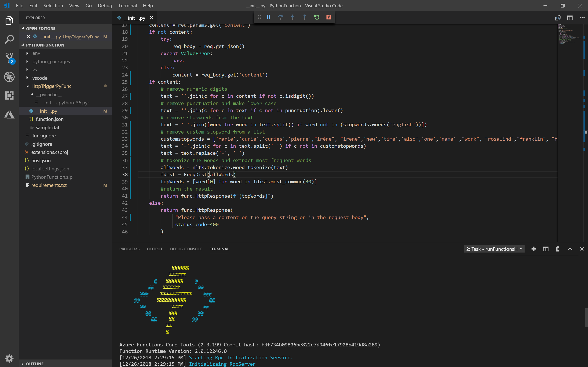
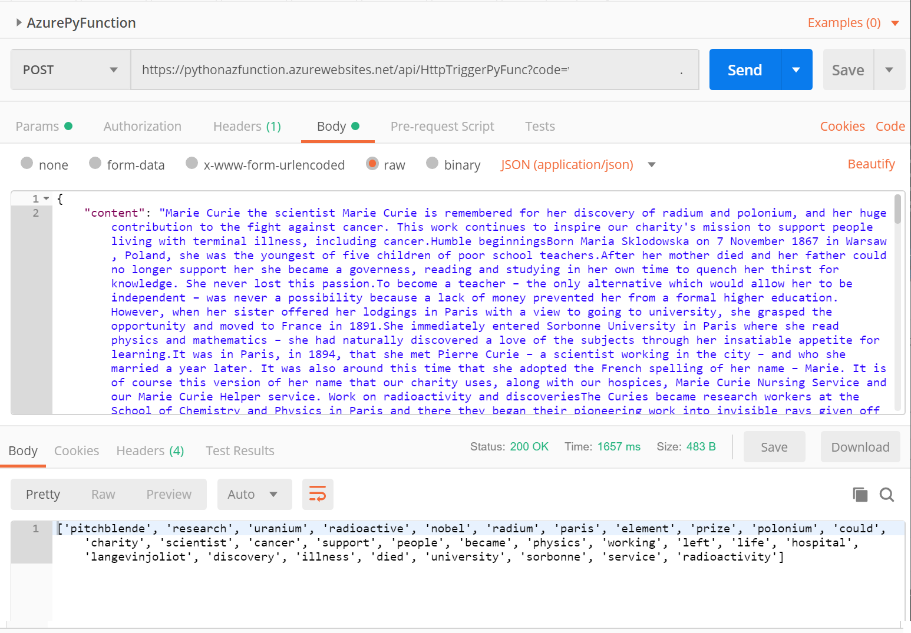

# Azure Functions with Python
If you haven't tried Azure Functions with Python, it is a great way to publish your REST services on a Serverless architecture and consume immediately.
Here's a sample I created for text analytics to normalize text using Python and published as service.

After installing Azure Function tools on VSCode, it's really easy to test your Python function on your local and publish to Azure as an Azure Function App.



* [Taking a closer look at Python support for Azure Functions](https://azure.microsoft.com/en-us/blog/taking-a-closer-look-at-python-support-for-azure-functions)
* For more details about [Azure Functions for Visual Studio Code (Preview)
](https://github.com/Microsoft/vscode-azurefunctions)
* For more details about [Create your first Python function in Azure (preview)
](https://docs.microsoft.com/en-us/azure/azure-functions/functions-create-first-function-python)

1. For the demo I used [Natural Language Toolkit - NLTK](https://www.nltk.org) for removing stop words, also prepared a custom list to remove some words which I would like to avoid. After that I tokenized the words and extract most frequent words from paragraphs using `FreqDist` from `nltk.probability`


    All third party python libraries can be defined in `requirement.txt` file to include into your environment
    ```txt
    azure-functions==1.0.0a5
    azure-functions-worker==1.0.0a6
    grpcio==1.14.2
    grpcio-tools==1.14.2
    protobuf==3.6.1
    six==1.12.0
    nltk==3.4
    ```
    After defining those packages you can import in your python code.
    ```python
    import azure.functions as func
    from string import punctuation
    import nltk
    nltk.download("punkt")
    nltk.download("stopwords")
    from nltk.corpus import stopwords
    from nltk.probability import FreqDist
    ```

    Here is the main function of our Python code.
    ```python
    def main(req: func.HttpRequest) -> func.HttpResponse:
        logging.info('Python HTTP trigger function processed a request.')

        content = req.params.get('content')
        if not content:
            try:
                req_body = req.get_json()
            except ValueError:
                pass
            else:
                content = req_body.get('content')
        if content:
            # remove numeric digits
            text = ''.join(c for c in content if not c.isdigit())
            # remove punctuation and make lower case
            text = ''.join(c for c in text if c not in punctuation).lower()
            text = text.replace('–', ' ')
            
            # remove stopwords from the text
            text = ' '.join([word for word in text.split() if word not in (stopwords.words('english'))])

            # remove custom stopword from a list
            with open("customstopwords.txt", "r") as f:
                customstopwords = f.read().splitlines()
            text = ' '.join(c for c in text.split(' ') if c not in customstopwords)
            
            # tokenize the words and extract most frequent words
            allWords = nltk.tokenize.word_tokenize(text)
            fdist = FreqDist(allWords)
            topWords = [word[0] for word in fdist.most_common(30)]
            
            #return the result
            return func.HttpResponse(f"{topWords}")
        else:
            return func.HttpResponse(
                "Please pass a content on the query string or in the request body",
                status_code=400
            )
    ```

1. After you test your function select `"Deploy to Function App"` to publish your local Azure funtion app to Azure Functions App.

    

1. After selecting your subscription and Azure Function App, your application will be deployed. All local environments and necessary libraries are zipped into `PythonFunction.zip` file.

    

1. You'll notice that your zip packages is uploaded to your blob storage of your Azure Function.

    

1. Then you can test your service using your Azure function endpoint.

    

## Materials
* [Taking a closer look at Python support for Azure Functions](https://azure.microsoft.com/en-us/blog/taking-a-closer-look-at-python-support-for-azure-functions)
* More details about [Azure Functions for Visual Studio Code (Preview)
](https://github.com/Microsoft/vscode-azurefunctions)
* More details about [Create your first Python function in Azure (preview)
](https://docs.microsoft.com/en-us/azure/azure-functions/functions-create-first-function-python)


Thanks!